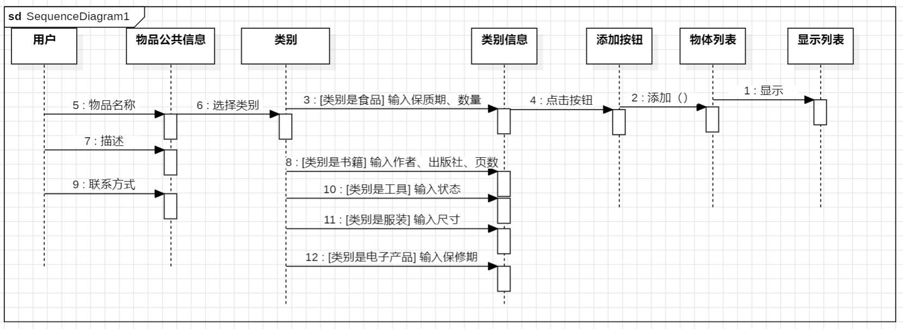
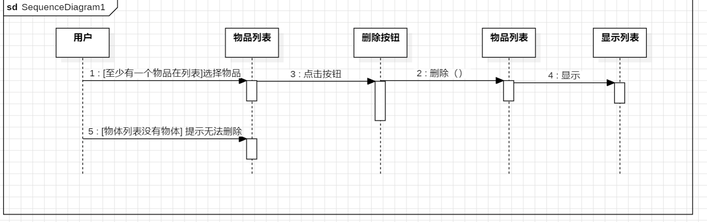
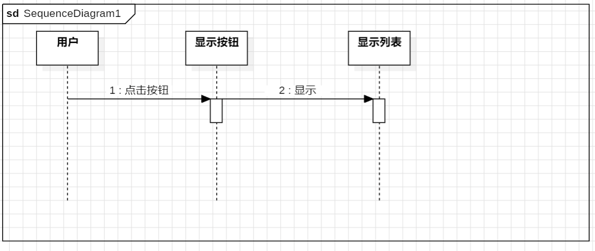
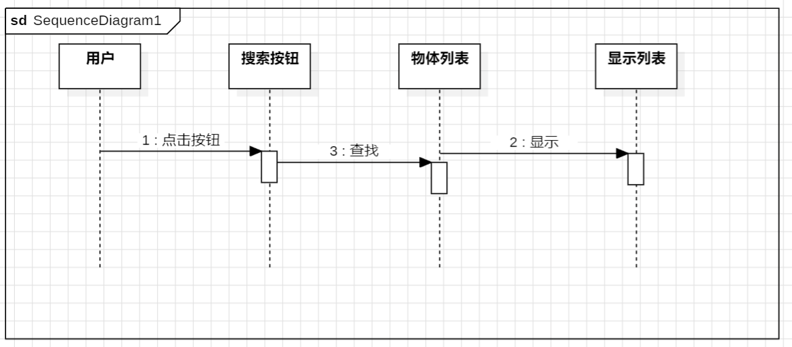
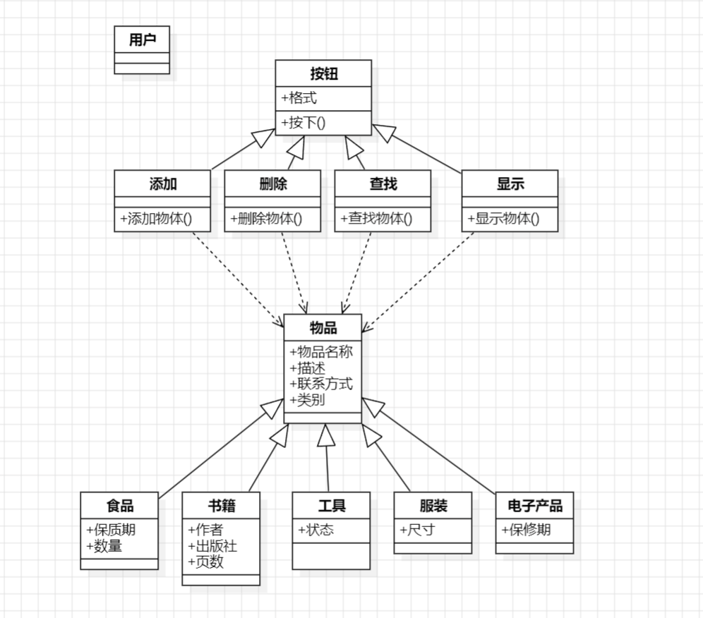

### 用例1
#### 用例名：
添加物品
#### 参与活动者：
用户
#### 进入条件：
用户访问主界面。
#### 事件流：
* 用户输入物品名称、描述和联系方式。
* 用户选择物品类别（例如，食品、书籍、工具等）。
* 根据选择的类别，动态显示类别特定的输入字段（如保质期、作者等）。
* 用户填写类别特定的字段（如食品类别填写保质期和数量）。
* 用户点击“添加物品”按钮。
* 系统验证输入字段，确保所有必填项已填写。
* 系统将物品数据保存至items.json文件。
* 系统显示添加成功的提示消息。
* 用户清空输入框，准备添加下一个物品。
#### 特殊需求：
如果某些字段为空，系统会弹出提示框，要求用户补充完整信息。
### 用例2
#### 用例名：
删除物品
#### 参与活动者：
用户
### 进入条件：
至少有一个物品已被添加。
#### 事件流：
* 用户在物品列表中选择一个物品。
* 用户点击“删除物品”按钮。
* 系统从物品列表中删除该物品。
* 系统更新物品列表并显示剩余物品。
* 系统保存更新后的物品列表至items.json文件。
#### 特殊需求：
如果用户没有选择物品，系统会弹出提示框，提示用户未选中任何物品。 
### 用例3
#### 用例名：
显示物品
#### 参与活动者：
用户
#### 进入条件：
至少有一个物品已被添加。
#### 事件流：
* 用户点击“显示物品”按钮。
* 系统从items.json文件加载物品数据。
* 系统在物品列表中展示所有物品信息（名称、描述、联系方式、类别、附加信息）。
#### 特殊需求：
如果没有物品数据，系统会显示一条消息，提示用户没有物品可显示。
### 用例4：
#### 用例名:
搜索物品
#### 参与活动者：
用户
#### 进入条件：
至少有一个物品已被添加。
#### 事件流：
* 用户在搜索框中输入物品名称或描述。
* 用户点击“搜索”按钮。
* 系统根据搜索条件（名称或描述）筛选物品。
* 系统显示符合搜索条件的物品。
* 如果有匹配的物品，系统在物品列表中展示符合条件的物品信息。
* 如果没有匹配的物品，系统显示提示消息，告诉用户没有找到匹配的物品。
#### 特殊需求：
如果用户没有输入任何搜索条件，系统会弹出提示框，提示用户输入搜索内容。

### 用例图：

### 类图：

